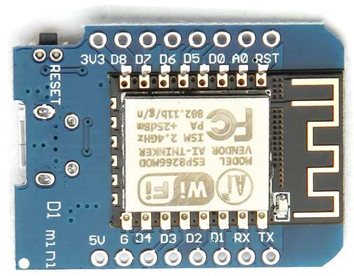

# Wemos d1 mini and the cheap TJCTM24028-SPI color touch display

A test according to http://nailbuster.com/?page_id=341.

| D1 mini | display |
| ------- | ------- |
| D1 | T_IRQ |
| D2 | T_CS |
| D4 | D/C |
| D5 | T_CLK, SCK |
| D6 | T_DO, SODI(MISO) |
| D7 | T_DIN, SDI(MOSI) |
| D8 | CS |
| G | GND |
| 3V3 | VCC, LED, RESET |

This works for test, but in continous operation, the d1 mini 5vto3.3v regulator may be overheated. So insert a 3v regulator between 5v and display LED pin.

XPTPaint.ini is a simple paint program. When started, it displays a blue clear button. Draw blue lines with your finger nail and touch clear to start over.
